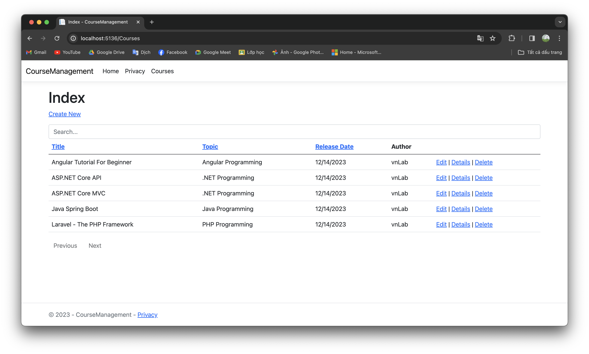

# Part 7: Add search, sorting, pagination to ASP.NET Core MVC application

>This tutorial teaches how to add search, sorting, pagination to ASP.NET Core MVC application. This guide is compiled based on [Get started with ASP.NET Core MVC](https://learn.microsoft.com/en-us/aspnet/core/tutorials/first-mvc-app/start-mvc?view=aspnetcore-8.0&tabs=visual-studio-code) by `Microsoft`.

In this section:

- Add search, sorting, pagination to ASP.NET Core MVC application.

Before coming to this guide, please refer to [Use dependency injection in .NET](https://github.com/NguyenPhuDuc307/dependency-injection).

## Add paging utility class

In the project folder, create `PaginatedList.cs`, and then replace the template code with the following code.

```c#
using Microsoft.EntityFrameworkCore;

namespace CourseManagement.ViewModels
{
    public class PaginatedList<T> : List<T>
    {
        public int PageIndex { get; private set; }
        public int TotalPages { get; private set; }

        public PaginatedList(List<T> items, int count, int pageIndex, int pageSize)
        {
            PageIndex = pageIndex;
            TotalPages = (int)Math.Ceiling(count / (double)pageSize);

            this.AddRange(items);
        }

        public bool HasPreviousPage => PageIndex > 1;

        public bool HasNextPage => PageIndex < TotalPages;

        public static PaginatedList<T> Create(IEnumerable<T> source, int pageIndex, int pageSize)
        {
            var count = source.Count();
            var items = source.Skip((pageIndex - 1) * pageSize).Take(pageSize).ToList();
            return new PaginatedList<T>(items, count, pageIndex, pageSize);
        }
    }
}
```

The `Create` method in this code takes page size and page number and applies the appropriate `Skip` and `Take` statements to the `IEnumerable`. The properties `HasPreviousPage` and `HasNextPage` can be used to enable or disable `Previous` and `Next` paging buttons.

## Add a method to interfaces and class for services

Add the following method to `ICoursesService.cs` interface:

```c#
Task<IEnumerable<CourseViewModel>> GetAllFilter(string sortOrder, string currentFilter, string searchString, int? pageNumber, int pageSize);
```

Implement `GetAllFilter` method in `CoursesService.cs`:

```c#
public async Task<IEnumerable<CourseViewModel>> GetAllFilter(string sortOrder, string currentFilter, string searchString, int? pageNumber, int pageSize)
{
    if (searchString != null)
    {
        pageNumber = 1;
    }
    else
    {
        searchString = currentFilter;
    }

    var courses = from m in _context.Courses select m;

    if (!String.IsNullOrEmpty(searchString))
    {
        courses = courses.Where(s => s.Title!.Contains(searchString)
        || s.Topic!.Contains(searchString)
        || s.Author!.Contains(searchString));
    }

    courses = sortOrder switch
    {
        "title_desc" => courses.OrderByDescending(s => s.Title),
        "topic" => courses.OrderBy(s => s.Topic),
        "topic_desc" => courses.OrderByDescending(s => s.Topic),
        "release_date" => courses.OrderBy(s => s.ReleaseDate),
        "release_date_desc" => courses.OrderByDescending(s => s.ReleaseDate),
        _ => courses.OrderBy(s => s.Title),
    };

    return PaginatedList<CourseViewModel>.Create(_mapper.Map<IEnumerable<CourseViewModel>>(await courses.ToListAsync()), pageNumber ?? 1, pageSize);
}
```

If the search string is changed during paging, the page has to be reset to 1, because the new filter can result in different data to display. The search string is changed when a value is entered in the text box and the Submit button is pressed. In that case, the searchString parameter isn't null.

The method uses LINQ to Entities to specify the column to sort by. The code creates an `IQueryable` variable before the switch statement, modifies it in the switch statement, and calls the `ToListAsync` method after the switch statement. When you create and modify `IQueryable` variables, no query is sent to the database. The query isn't executed until you convert the `IQueryable` object into a collection by calling a method such as `ToListAsync`.

Update method `Index` in `CoursesController.cs` controller with the following code:

```c#
public async Task<IActionResult> Index(string sortOrder, string currentFilter, string searchString, int? pageNumber)
{
    ViewData["TitleSortParm"] = String.IsNullOrEmpty(sortOrder) || sortOrder.Equals("title") ? "title_desc" : "";
    ViewData["TopicSortParm"] = String.IsNullOrEmpty(sortOrder) || sortOrder.Equals("topic") ? "topic_desc" : "topic";
    ViewData["ReleaseDateSortParm"] = String.IsNullOrEmpty(sortOrder) || sortOrder.Equals("release_date") ? "release_date_desc" : "release_date";

    ViewData["CurrentFilter"] = searchString;
    ViewData["CurrentSort"] = sortOrder;

    return View(await _coursesService.GetAllFilter(sortOrder, currentFilter, searchString, pageNumber, PAGESIZE));
}
```

These are ternary statements. The first one specifies that if the `sortOrder` parameter is null or empty, TitleSortParm should be set to "title_desc"; otherwise, it should be set to an empty string.

The `ViewData` element named `CurrentSort` provides the view with the current sort order, because this must be included in the paging links in order to keep the sort order the same while paging.

The `ViewData` element named `CurrentFilter` provides the view with the current filter string. This value must be included in the paging links in order to maintain the filter settings during paging, and it must be restored to the text box when the page is redisplayed.

Update View `Index` in `Views/Courses/Index.cshtml` with the following code:

```html
@model PaginatedList<CourseViewModel>

@{
    ViewData["Title"] = "Index";
}

<h1>Index</h1>

<p>
    <a asp-action="Create">Create New</a>
</p>

<form asp-action="Index">
    <div class="d-flex">
        <input class="form-control" placeholder="Search..." value="@ViewData["CurrentFilter"]" type="text"
               autocomplete="off" name="SearchString" />
    </div>
</form>

<table class="table">
    <thead>
        <tr>
            <th>
                <a asp-action="Index" asp-route-sortOrder="@ViewData["TitleSortParm"]"
                   asp-route-currentFilter="@ViewData["CurrentFilter"]">
                    @Html.DisplayNameFor(model => model[0].Title)
                </a>
            </th>
            <th>
                <a asp-action="Index" asp-route-sortOrder="@ViewData["TopicSortParm"]"
                   asp-route-currentFilter="@ViewData["CurrentFilter"]">
                    @Html.DisplayNameFor(model => model[0].Topic)
                </a>
            </th>
            <th>
                <a asp-action="Index" asp-route-sortOrder="@ViewData["ReleaseDateSortParm"]"
                   asp-route-currentFilter="@ViewData["CurrentFilter"]">
                    @Html.DisplayNameFor(model => model[0].ReleaseDate)
                </a>
            </th>
            <th>
                @Html.DisplayNameFor(model => model[0].Author)
            </th>
            <th></th>
        </tr>
    </thead>
    <tbody>
        @foreach (var item in Model)
        {
            <tr>
                <td>
                    @Html.DisplayFor(modelItem => item.Title)
                </td>
                <td>
                    @Html.DisplayFor(modelItem => item.Topic)
                </td>
                <td>
                    @Html.DisplayFor(modelItem => item.ReleaseDate)
                </td>
                <td>
                    @Html.DisplayFor(modelItem => item.Author)
                </td>
                <td>
                    <a asp-action="Edit" asp-route-id="@item.Id">Edit</a> |
                    <a asp-action="Details" asp-route-id="@item.Id">Details</a> |
                    <a asp-action="Delete" asp-route-id="@item.Id">Delete</a>
                </td>
            </tr>
        }
    </tbody>
</table>

@{
    var prevDisabled = !Model.HasPreviousPage ? "disabled" : "";
    var nextDisabled = !Model.HasNextPage ? "disabled" : "";
}

<a asp-action="Index" asp-route-sortOrder="@ViewData["CurrentSort"]" asp-route-pageNumber="@(Model.PageIndex - 1)"
   asp-route-currentFilter="@ViewData["CurrentFilter"]" class="btn btn-default @prevDisabled">
    Previous
</a>
<a asp-action="Index" asp-route-sortOrder="@ViewData["CurrentSort"]" asp-route-pageNumber="@(Model.PageIndex + 1)"
   asp-route-currentFilter="@ViewData["CurrentFilter"]" class="btn btn-default @nextDisabled">
    Next
</a>
```

This code uses the `<form>` tag helper to add the search text box and button. By default, the `<form>` tag helper submits form data with a POST, which means that parameters are passed in the HTTP message body and not in the URL as query strings. When you specify HTTP GET, the form data is passed in the URL as query strings, which enables users to bookmark the URL. The W3C guidelines recommend that you should use GET when the action doesn't result in an update.

In sort order we use the information in ViewData properties to set up hyperlinks with the appropriate query string values.

The `@model` statement at the top of the page specifies that the view now gets a `PaginatedList<T>` object instead of a `List<T>` object.

To add filtering to the Courses Index page, you'll add a text box and a submit button to the view and make corresponding changes in the `Index` method. The text box will let you enter a string to search for in the first name and last name fields.

**Final, run the application to test functions:**

Run the following command:

```bash
dotnet watch run
```



Next let's [Introduction to relationships](https://github.com/NguyenPhuDuc307/relationships).
